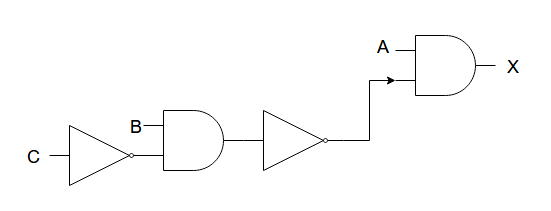
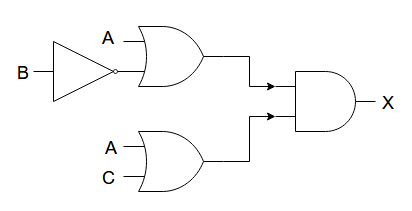
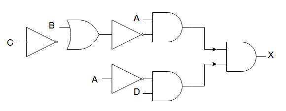

# COMP110 Worksheet 4


## Question 1

### A: A AND B AND NOT C

 A | B | C | A AND B | NOT C | A AND B AND NOT C
---|---|---|---|---|---
 0 | 0 | 0 | 0 | 1 | 0
 0 | 0 | 1 | 0 | 0 | 0
 0 | 1 | 0 | 0 | 1 | 0
 0 | 1 | 1 | 0 | 0 | 0
 1 | 0 | 0 | 0 | 1 | 0
 1 | 1 | 0 | 1 | 1 | 1
 1 | 1 | 1 | 1 | 0 | 0

### B: A AND NOT (B AND NOT C)

 A | B | C | NOT C | B AND NOT C | NOT (B AND NOT C) | A AND NOT (B AND NOT C)
---|---|---|---|---|---|---
 0 | 0 | 0 | 1 | 0 | 1 | 0
 0 | 0 | 1 | 0 | 0 | 1 | 0
 0 | 1 | 0 | 1 | 1 | 0 | 0
 0 | 1 | 1 | 0 | 0 | 1 | 0
 1 | 0 | 0 | 0 | 0 | 1 | 1
 1 | 0 | 1 | 1 | 0 | 1 | 1
 1 | 1 | 0 | 0 | 1 | 0 | 0
 1 | 1 | 1 | 1 | 0 | 1 | 1

### C: (A OR NOT B)  AND  (A OR C)

 A | B | C |NOT B|A OR NOT B| A OR C|(A OR NOT B) AND (A OR C)
---|---|---|---|---|---|---
 0 | 0 | 0 | 1 | 1 | 0 | 0
 0 | 0 | 1 | 1 | 1 | 1 | 1
 0 | 1 | 0 | 0 | 0 | 0 | 0
 0 | 1 | 1 | 0 | 0 | 1 | 0
 1 | 0 | 0 | 1 | 1 | 1 | 1
 1 | 0 | 1 | 1 | 1 | 1 | 1
 1 | 1 | 0 | 0 | 1 | 1 | 1
 1 | 1 | 1 | 0 | 1 | 1 | 1

### D: A AND NOT (B OR NOT C) AND (NOT A AND D)

 A | B | C | D |NOT C|NOT A|NOT A AND D|B OR NOT C|NOT (B OR NOT C)|A AND NOT (B OR NOT C)|A AND NOT (B OR NOT C) AND (NOT A AND D)
---|---|---|---|---|---|---|---|---|---|---
 0 | 0 | 0 | 0 | 1 | 1 | 0 | 1 | 0 | 0 | 0
 0 | 0 | 0 | 1 | 1 | 1 | 1 | 1 | 0 | 0 | 0
 0 | 0 | 1 | 0 | 0 | 1 | 0 | 0 | 1 | 0 | 0 
 0 | 0 | 1 | 1 | 0 | 1 | 1 | 0 | 1 | 0 | 0 
 0 | 1 | 0 | 0 | 1 | 1 | 0 | 1 | 0 | 0 | 0 
 0 | 1 | 0 | 1 | 1 | 1 | 1 | 1 | 0 | 0 | 0 
 0 | 1 | 1 | 0 | 0 | 1 | 0 | 1 | 0 | 0 | 0 
 0 | 1 | 1 | 1 | 0 | 1 | 1 | 1 | 0 | 0 | 0 
 1 | 0 | 0 | 0 | 1 | 0 | 0 | 1 | 0 | 0 | 0 
 1 | 0 | 0 | 1 | 1 | 0 | 0 | 1 | 0 | 0 | 0 
 1 | 0 | 1 | 0 | 0 | 0 | 0 | 0 | 1 | 1 | 0 
 1 | 0 | 1 | 1 | 0 | 0 | 0 | 0 | 1 | 1 | 0 
 1 | 1 | 0 | 0 | 1 | 0 | 0 | 1 | 0 | 0 | 0 
 1 | 1 | 0 | 1 | 1 | 0 | 0 | 1 | 0 | 0 | 0 
 1 | 1 | 1 | 0 | 0 | 0 | 0 | 1 | 0 | 0 | 0 
 1 | 1 | 1 | 1 | 0 | 0 | 0 | 1 | 0 | 0 | 0 


## Question 2

### A: A AND B AND NOT C


### B: A AND NOT (B AND NOT C)



### C: (A OR NOT B)  AND  (A OR C)



### D: A AND NOT (B OR NOT C) AND (NOT A AND D)




## Question 3

### A: NOT (A OR B) = NOT A AND NOT B

 A | B | A OR B | NOT A | NOT B | NOT (A OR B) | NOT A AND NOT B
---|---|---|---|---|---|---
 0 | 0 | 0 | 1 | 1 | 1 | 1 
 0 | 1 | 1 | 1 | 0 | 0 | 0 
 1 | 0 | 1 | 0 | 1 | 0 | 0 
 1 | 1 | 1 | 0 | 0 | 0 | 0 
 
### B: NOT (A AND B) = NOT A OR NOT B

 A | B | A AND B | NOT A | NOT B | NOT (A AND B) | NOT A OR NOT B
---|---|---|---|---|---|---
 0 | 0 | 0 | 1 | 1 | 1 | 1 
 0 | 1 | 0 | 1 | 0 | 1 | 1 
 1 | 0 | 0 | 0 | 1 | 1 | 1 
 1 | 0 | 0 | 0 | 1 | 1 | 1 
 1 | 1 | 1 | 0 | 0 | 0 | 0 

### C: (A AND B) OR (A AND C) = A AND (B OR C)

 A | B | C | A AND B | A AND C | B OR C | (A AND B) OR (A AND C) | A AND (B OR C)
---|---|---|---|---|---|---|---
 0 | 0 | 0 | 0 | 0 | 0 | 0 | 0 
 0 | 0 | 1 | 0 | 0 | 1 | 0 | 0 
 0 | 1 | 0 | 0 | 0 | 1 | 0 | 0 
 0 | 1 | 1 | 0 | 0 | 1 | 0 | 0 
 1 | 0 | 0 | 0 | 0 | 0 | 0 | 0 
 1 | 0 | 1 | 0 | 1 | 1 | 1 | 1 
 1 | 1 | 0 | 1 | 0 | 1 | 1 | 1 
 1 | 1 | 1 | 1 | 1 | 1 | 1 | 1 

### D: (A OR B) AND (A OR C) = A OR (B AND C)

 A | B | C | A OR B | A OR C | B AND C | (A OR B) AND (A OR C) | A OR (B AND C)
---|---|---|---|---|---|---|---
 0 | 0 | 0 | 0 | 0 | 0 | 0 | 0 
 0 | 0 | 1 | 0 | 1 | 0 | 0 | 0 
 0 | 1 | 0 | 1 | 0 | 0 | 0 | 0 
 0 | 1 | 1 | 1 | 1 | 1 | 1 | 1 
 1 | 0 | 0 | 1 | 1 | 0 | 1 | 1 
 1 | 0 | 1 | 1 | 1 | 0 | 1 | 1 
 1 | 1 | 0 | 1 | 1 | 0 | 1 | 1 
 1 | 1 | 1 | 1 | 1 | 1 | 1 | 1

## Question 4

### A

It is the same as Question 3B.

```python
if not(file_exists("a.txt") and file_exists("b.txt"))
```

Is the same as: NOT ( A AND B)

### B

### C

### D

