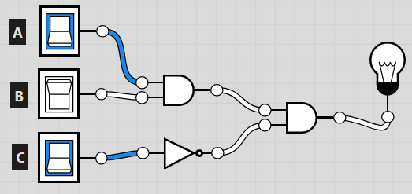
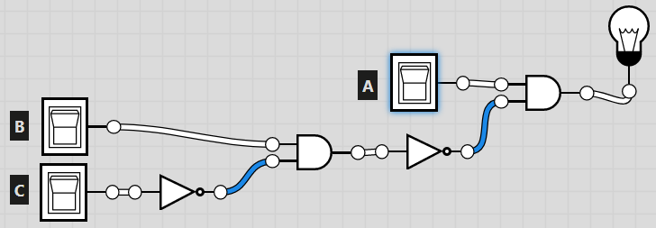
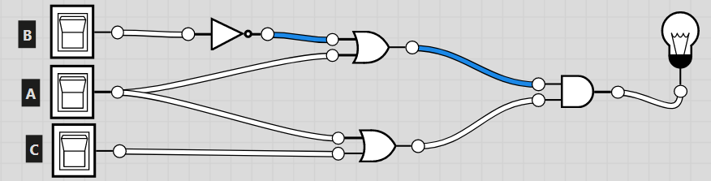
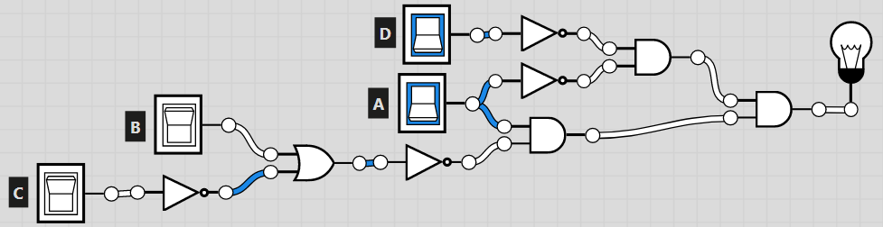

# COMP110 Worksheet 4

Solutions to problem sheet by James Arthur.

## Question 1

### a
A AND B AND NOT C

| a | b | c | a and b | a and b and not c |
|---|---|---|---------|-------------------|
| F | F | F | F | F |
| F | F | T | F | F |
| F | T | F | F | F |
| F | T | T | T | F |
| T | F | F | F | F |
| T | T | F | T | T |
| T | T | T | T | F |

### b
A AND NOT (B AND NOT C)

| a | b | c | b and not c | a and not (b and not c) |
|---|:-:|--:|-------------|-------------------------|
| F | F | F | F | F | 
| F | F | T | F | F |
| F | T | F | T | F |
| F | T | T | F | F |
| T | F | F | F | T |
| T | F | T | F | T |
| T | T | F | T | F |
| T | T | T | F | T |

### c
(A OR NOT B) AND (A OR C)

| a | b | c | b and not c | a and not (b and not c) |
|---|:-:|--:|-------------|-------------------------|
| F | F | T | F | F |
| F | T | F | T | F |
| F | T | T | F | F |
| T | F | F | F | T |
| T | F | T | F | T |
| T | T | F | T | F |
| T | T | T | F | T |

### d

A AND NOT (B OR NOT C) AND (NOT A AND D)

| a | b | c | d | b or not c | not a and d | a and not (b or not c) | a and not (b or not c) and (not a and d) |
|---|:-:|--:|---|------------|-------------|------------------------|------------------------------------------|
| F | F | F | F | T | F | F | F |
| F | F | F | T | T | T | F | F |
| F | F | T | F | F | F | F | F |
| F | F | T | T | F | T | F | F |
| F | T | F | F | T | F | F | F |
| F | T | F | T | T | T | F | F |
| F | T | T | F | T | F | F | F |
| F | T | T | T | T | T | F | F |
| T | F | F | F | T | F | F | F |
| T | F | F | T | T | F | F | F |
| T | F | T | F | F | F | T | F |
| T | F | T | T | F | F | T | F |
| T | T | F | F | T | F | F | F |
| T | T | F | T | T | F | F | F |
| T | T | T | F | T | F | F | F |
| T | T | T | T | T | F | F | F |

## Question 2

### a

### b

### c

### d

## Question 3

### a
NOT (A OR B) = NOT A AND NOT B

| A | B | A or B | NOT (A or B) |
|---|:-:|-------:|--------------|
| F | F | F | T |
| F | T | T | F |
| T | F | T | F |
| T | T | T | F |

| A | B | NOT A AND NOT B |
|---|:-:|----------------:|
| F | F | T |
| F | T | F |
| T | F | F |
| T | T | F |

\therefore equality holds

### b
NOT (A AND B) = NOT A OR NOT B

| A | B | A AND B | NOT (A AND B) |
|---|:-:|--------:|---------------|
| F | F | F | T |
| F | T | F | T |
| T | F | F | T |
| T | T | T | F |

| A | B | NOT A OR NOT B |
|---|:-:|---------------:|
| F | F | T |
| F | T | T |
| T | F | T |
| T | T | F |

### c
(A AND B) OR (A AND C) = A AND (B OR C)

| A | B | C | (A AND B) OR (A AND C) |
|---|:-:|--:|--------------------------|
| F | F | F | F |
| F | F | T | F |
| F | T | F | F |
| F | T | T | F |
| T | F | F | F |
| T | F | T | T |
| T | T | F | T |
| T | T | T | T |

| A | B | C | (A AND (B OR C)) |
|---|:-:|--:|------------------|
| F | F | F | F |
| F | F | T | F |
| F | T | F | F |
| F | T | T | F |
| T | F | F | F |
| T | F | T | T |
| T | T | F | T |
| T | T | T | T |

### d
(A OR B) AND (A OR C) = A OR (B AND C)

| A | B | C | (A OR B) AND (A OR C) |
|---|:-:|--:|-----------------------|
| F | F | F | F |
| F | F | T | F |
| F | T | F | F |
| F | T | T | T |
| T | F | F | T |
| T | F | T | T |
| T | T | F | T |
| T | T | T | T |

| A | B | C | (A OR (B AND C)) |
|---|:-:|--:|------------------|
| F | F | F | F |
| F | F | T | F |
| F | T | F | F |
| F | T | T | T |
| T | F | F | T |
| T | F | T | T |
| T | T | F | T |
| T | T | T | T |

## Question 4
### a

Using identity (b) from the previous question, it is obvious to see that the two conditionals in the if statements are equal.

### b

Using the 'OR' de morgan law, this proves that the if statements are equal

### c

Consider that the code inside the if and else statements are swapped, the conditional statements also nned to be swapped to counteract the change. Knowing that '==' is equal to '!(!=)', then '==' is the opposite to '!=', then to counteract the swap, the '==' needs to be changed to '!='.

### d

Use the de morgan 'AND' law, then we need to consider the two statements produced. x > 10 or x > 0 => x > 0, so can be interchanged to get the desired result. 

