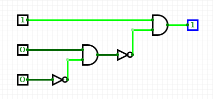
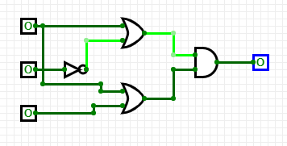

# COMP110 Worksheet 4

Please edit this README.md file with your answers to the worksheet questions.

## Question 1

### a
| A | B | C | A^B^¬C |
|---|---|---|--------|
| 0 | 0 | 0 | 0      |
| 0 | 0 | 1 | 0      |
| 0 | 1 | 0 | 0      |
| 1 | 0 | 0 | 0      |
| 0 | 1 | 1 | 0      |
| 1 | 1 | 0 | 1      |
| 1 | 0 | 1 | 0      |
| 1 | 1 | 1 | 0      |

### b
| A | B | C | A^¬(B^¬C) |
|---|---|---|-----------|
| 0 | 0 | 0 | 0         |
| 0 | 0 | 1 | 0         |
| 0 | 1 | 0 | 0         |
| 0 | 1 | 1 | 0         |
| 1 | 0 | 0 | 1         |
| 1 | 0 | 1 | 1         |
| 1 | 1 | 0 | 0         |
| 1 | 1 | 1 | 1         |

### c
| A | B | C | (A∨¬B)∧(A∨C) |
|---|---|---|--------------|
| 0 | 0 | 0 | 0            |
| 0 | 0 | 1 | 1            |
| 0 | 1 | 0 | 0            |
| 0 | 1 | 1 | 0            |
| 1 | 0 | 0 | 1            |
| 1 | 0 | 1 | 1            |
| 1 | 1 | 0 | 1            |
| 1 | 1 | 1 | 1            |

### d
| A | B | C | D | A∧¬(B∨¬C)∧(¬A∧D) |
|---|---|---|---|------------------|
| 0 | 0 | 0 | 0 | 0                |
| 0 | 0 | 0 | 1 | 0                |
| 0 | 0 | 1 | 0 | 0                |
| 0 | 0 | 1 | 1 | 0                |
| 0 | 1 | 0 | 0 | 0                |
| 0 | 1 | 0 | 1 | 0                |
| 0 | 1 | 1 | 0 | 0                |
| 0 | 1 | 1 | 1 | 0                |
| 1 | 0 | 0 | 0 | 0                |
| 1 | 0 | 0 | 1 | 0                |
| 1 | 0 | 1 | 0 | 0                |
| 1 | 0 | 1 | 1 | 0                |
| 1 | 1 | 0 | 0 | 0                |
| 1 | 1 | 0 | 1 | 0                |
| 1 | 1 | 1 | 0 | 0                |
| 1 | 1 | 1 | 1 | 0                |

## Question 2

### a

### b

### c

### d

## Question 3

### a
| A | B | ¬(A∨B) | ¬A^¬B |
|---|---|--------|-------|
| 0 | 0 | 1      | 1     |
| 0 | 1 | 0      | 0     |
| 1 | 0 | 0      | 0     |
| 1 | 1 | 0      | 0     |

### b
| A | B | ¬(A∧B) | ¬A∨¬B |
|---|---|--------|-------|
| 0 | 0 | 1      | 1     |
| 0 | 1 | 1      | 1     |
| 1 | 0 | 1      | 1     |
| 1 | 1 | 0      | 0     |

### c
| A | B | C | (A∧B)∨(A∧C) | A^(B∨C) |
|---|---|---|-------------|---------|
| 0 | 0 | 0 | 0           | 0       |
| 0 | 0 | 1 | 0           | 0       |
| 0 | 1 | 0 | 0           | 0       |
| 0 | 1 | 1 | 0           | 0       |
| 1 | 0 | 0 | 0           | 0       |
| 1 | 0 | 1 | 1           | 1       |
| 1 | 1 | 0 | 1           | 1       |
| 1 | 1 | 1 | 1           | 1       |

### d
| A | B | C | (A∨B)∧(A∨C) | A∨(B^C) |
|---|---|---|-------------|---------|
| 0 | 0 | 0 | 0           | 0       |
| 0 | 0 | 1 | 0           | 0       |
| 0 | 1 | 0 | 0           | 0       |
| 0 | 1 | 1 | 1           | 1       |
| 1 | 0 | 0 | 1           | 1       |
| 1 | 0 | 1 | 1           | 1       |
| 1 | 1 | 0 | 1           | 1       |
| 1 | 1 | 1 | 1           | 1       |

## Question 4

### a
The two programs are equivalent because they equate to the truth table in 3B, (¬(A^B) = ¬A ∨ ¬B) this works because only if A and B are both true, will the AND gate be true, however, since the NOT symbol is in use, the answer is true when either of them are on or both are off, but not when both are on. This works the same way as the second program because the output will only ever be false if both A and B start as true before they are converted to false through the NOT symbol.

### b
These two programs are the same as the truth table used in 3C because there is no need to check A twice in the same statement, if A is false then both programs fail anyway, therefore the program can be simplified by checking if either B or C are true, because, if so, the program will function as long as A is still positive. The logic gates "(A and B) or (A and C)" cancel each other out, leaving A and (B or C) which equates to the second method of showing this program.

### c
This set of programs follows the answer to 3A, in which if neither A nor B are true then the program will do_something(), this correlates to the fact that the truth table only outputs true if both A and B are false, due to the NOT gate. This functions the same way in both identities of 3A.

### d
The final set of programs correlates to the identities of 3D, where the first programs equates to the second identity of (A or (B AND C)), whereas the second program correlates to ((A OR B) AND (A OR C)) without using the initial comparison between (A OR B). However, the conditions are still reversable and the program output will be the same from both programs.
