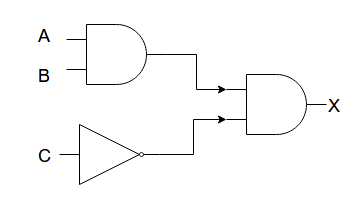

# COMP110 Worksheet 4

## Question 1

### A: A AND B AND NOT C

A | B | C | A AND B | NOT C | A AND B AND NOT C
---|---|---|---|---|---
 0 | 0 | 0 | 0 | 1 | 0
 0 | 0 | 1 | 0 | 0 | 0
 0 | 1 | 0 | 0 | 1 | 0
 0 | 1 | 1 | 0 | 0 | 0
 1 | 0 | 0 | 0 | 1 | 0
 1 | 1 | 0 | 1 | 1 | 1
 1 | 1 | 1 | 1 | 0 | 0

### B: A AND NOT (B AND NOT C)

A | B | C | NOT C | B AND NOT C | NOT (B AND NOT C) | A AND NOT (B AND NOT C)
---|---|---|---|---|---|---
 0 | 0 | 0 | 1 | 0 | 1 | 0
 0 | 0 | 1 | 0 | 0 | 1 | 0
 0 | 1 | 0 | 1 | 1 | 0 | 0
 0 | 1 | 1 | 0 | 0 | 1 | 0
 1 | 0 | 0 | 0 | 0 | 1 | 1
 1 | 0 | 1 | 1 | 0 | 1 | 1
 1 | 1 | 0 | 0 | 1 | 0 | 0
 1 | 1 | 1 | 1 | 0 | 1 | 1

### C: (A OR NOT B)  AND  (A OR C)

A | B | C |NOT B|A OR NOT B| A OR C|(A OR NOT B) AND (A OR C)
---|---|---|---|---|---|---
 0 | 0 | 0 | 1 | 1 | 0 | 0
 0 | 0 | 1 | 1 | 1 | 1 | 1
 0 | 1 | 0 | 0 | 0 | 0 | 0
 0 | 1 | 1 | 0 | 0 | 1 | 0
 1 | 0 | 0 | 1 | 1 | 1 | 1
 1 | 0 | 1 | 1 | 1 | 1 | 1
 1 | 1 | 0 | 0 | 1 | 1 | 1
 1 | 1 | 1 | 0 | 1 | 1 | 1

### D: A AND NOT (B OR NOT C) AND (NOT A AND D)

A | B | C | D |NOT C|NOT A|NOT A AND D|B OR NOT C|NOT (B OR NOT C)|A AND NOT (B OR NOT C)|A AND NOT (B OR NOT C) AND (NOT A AND D)
---|---|---|---|---|---|---|---|---|---|---
 0 | 0 | 0 | 0 | 1 | 1 | 0 | 1 | 0 | 0 | 0
 0 | 0 | 0 | 1 | 1 | 1 | 1 | 1 | 0 | 0 | 0
 0 | 0 | 1 | 0 | 0 | 1 | 0 | 0 | 1 | 0 | 0 
 0 | 0 | 1 | 1 | 0 | 1 | 1 | 0 | 1 | 0 | 0 
 0 | 1 | 0 | 0 | 1 | 1 | 0 | 1 | 0 | 0 | 0 
 0 | 1 | 0 | 1 | 1 | 1 | 1 | 1 | 0 | 0 | 0 
 0 | 1 | 1 | 0 | 0 | 1 | 0 | 1 | 0 | 0 | 0 
 0 | 1 | 1 | 1 | 0 | 1 | 1 | 1 | 0 | 0 | 0 
 1 | 0 | 0 | 0 | 1 | 0 | 0 | 1 | 0 | 0 | 0 
 1 | 0 | 0 | 1 | 1 | 0 | 0 | 1 | 0 | 0 | 0 
 1 | 0 | 1 | 0 | 0 | 0 | 0 | 0 | 1 | 1 | 0 
 1 | 0 | 1 | 1 | 0 | 0 | 0 | 0 | 1 | 1 | 0 
 1 | 1 | 0 | 0 | 1 | 0 | 0 | 1 | 0 | 0 | 0 
 1 | 1 | 0 | 1 | 1 | 0 | 0 | 1 | 0 | 0 | 0 
 1 | 1 | 1 | 0 | 0 | 0 | 0 | 1 | 0 | 0 | 0 
 1 | 1 | 1 | 1 | 0 | 0 | 0 | 1 | 0 | 0 | 0 

## Question 2

### A

### b

### c

### d

## Question 3

### a

### b

### c

### d

## Question 4

### a

### b

### c

### d

