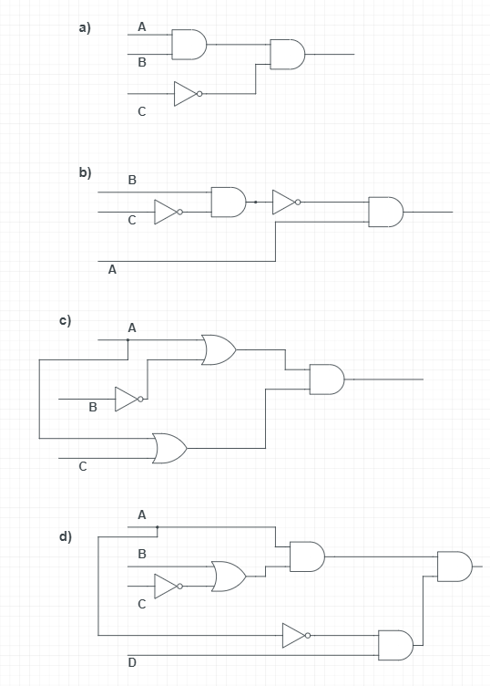

# COMP110 Worksheet 4

Please edit this README.md file with your answers to the worksheet questions.

I did all of them on paper, then copied them using Markdown. The answers are right, I just hope the starting values have been copied properly from paper.
## Question 1

### a
|A|B|C|A x B x C'|
|---|---|---|---|
|1|1|1|0|
|1|1|0|1|
|1|0|1|0|
|0|1|1|0|
|1|0|0|0|
|0|0|1|0|
|0|0|0|0|
|0|1|0|0|

### b
|A|B|C|A x (B x C')'|
|---|---|---|---|
|1|1|1|1|
|1|1|0|0|
|1|0|1|1|
|0|1|1|0|
|1|0|0|1|
|0|0|1|0|
|0|0|0|0|
|0|1|0|0|
### c
|A|B|C|(A+B') x ( A+C)|
|---|---|---|---|
|1|1|1|1|
|1|1|0|1|
|1|0|1|1|
|0|1|1|0|
|1|0|0|1|
|0|0|1|1|
|0|0|0|0|
|0|1|0|0|
### d
|A|B|C|D|A x (B+C')' x (A' x D)|
|---|---|---|---|---|
|1|1|1|1|0|
|1|1|1|0|0|
|1|1|0|1|0|
|1|1|0|0|0|
|1|0|1|1|0|
|1|0|1|0|0|
|1|0|0|1|0|
|1|0|0|0|0|
|0|1|1|1|0|
|0|1|1|0|0|
|0|1|0|1|0|
|0|1|0|0|0|
|0|0|1|1|0|
|0|0|1|0|0|
|0|0|0|1|0|
|0|0|0|0|0|

## Question 2

## Question 3

### a
|A|B|A+B|(A+B)'|A'|B'|A' x B'|
|---|---|---|---|---|---|---|
|0|1|1|*0*|1|0|*0*|
|1|0|1|*0*|0|1|*0*|
|1|1|1|*0*|0|0|*0*|
|0|0|0|*1*|1|1|*0*|
### b
|A|B|AxB|(AxB)'|A'|B'|A' + B'|
|---|---|---|---|---|---|---|
|0|1|0|*1*|1|0|*1*|
|1|0|0|*1*|0|1|*1*|
|1|1|1|*0*|0|0|*0*|
|0|0|0|*1*|1|1|*1*|
### c
|A|B|C|AxB|AxC|(AxB) + (AxC)|A x (B+C)|
|---|---|---|---|---|---|---|
|0|0|0|0|0|0|0|
|0|0|1|0|0|0|0|
|0|1|0|0|0|0|0|
|1|0|0|0|0|0|0|
|0|1|1|0|0|1|1|
|1|1|0|1|0|1|1|
|1|1|1|1|1|1|1|
|1|0|1|0|1|1|1|
### d
|A|B|C|A+B|A+C|(A+B) x (A+C)|A + (BxC)|
|---|---|---|---|---|---|---|
|0|0|0|0|0|0|0|
|0|0|1|0|1|0|0|
|0|1|0|1|0|0|0|
|1|0|0|1|1|1|1|
|0|1|1|1|1|1|1|
|1|1|0|1|1|1|1|
|1|1|1|1|1|1|1|
|1|0|1|1|1|1|1|

## Question 4

### a
The question translates to (AxB)' = A' + B', which works for every possible combination of variable values.
For the first option, if we do not have both the "a.txt" file and "b.txt" file, then at least one of them is missing. For the second one, if either one of them is missing then at least one is missing.
### b
The question translates to (A x B) + (C x A) =  (B + C) x A, which works for every possible combination of variable values.
For the first option, _Hello_ will be printed if _x_ is either greater than 7 and an integer or greater than 7 and a float. In the second option, if _x_ is either an integer or a float and a number greater than 7, _hello_ is printed on the screen.
### c
The question translates to (AxB)' = A' + B'. Comparing the two _if_ statements, we are able to notice the fact that their results are inverted/flipped, the first one masking the fact that it is actually NOT(A and B). The results of the if and else statements are flipped when compared to the other option, underlining the fact that it is a NOT in the first _if_ statement.
### d
The question translates to A + (B x C) = B x (A + C), which are *not* equal.
The following table proves it:
|A|B|C|B x C| A + (BxC)| A + C| B x (A+C)|
|---|---|---|---|---|---|---|
|0|0|0|0|0|0|0|
|0|0|1|0|0|1|0|
|0|1|0|0|0|0|0|
|0|1|1|1|1|1|1|
|1|0|0|0|1|1|0|
|1|0|1|0|1|1|0|
|1|1|0|0|1|1|1|
|1|1|1|1|1|1|1|

