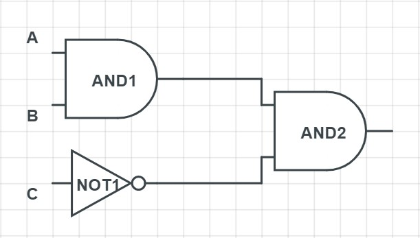

# COMP110 Worksheet 4

Please edit this README.md file with your answers to the worksheet questions.

## Question 1

### a
| A | B | C  | A and B  | Not C | A and B and Not C 
---|---|---|---|---|---
| 0 | 0 | 0  |    0     | 1     | 0                 |
| 1 | 0 | 0  |    0     | 1     | 0                 |
| 0 | 1 | 0  |    0     | 1     | 0                 |
| 0 | 0 | 1  |    0     | 0     | 0                 |
| 1 | 1 | 1  |    1     | 0     | 0                 |
| 1 | 1 | 0  |    1     | 1     | 1                 |
| 0 | 1 | 1  |    0     | 0     | 0                 |
| 1 | 0 | 1  |    0     | 0     | 0                 |

### b

| A | B | C | Not C | B and Not C | Not (B and Not C) | A and Not (B and Not C) |
---|---|---|---|---|---|---
| 0 | 0 | 0 |   1    |     0      |         1         |             0           |
| 0 | 1 | 0 |   1    |     1      |         0         |             0           |
| 0 | 0 | 1 |   0    |     0      |         1         |             0           |
| 0 | 1 | 1 |   0    |     0      |         1         |             0           |
| 1 | 0 | 0 |   1    |     0      |         1         |             1           |
| 1 | 1 | 0 |   1    |     1      |         0         |             0           |
| 1 | 0 | 1 |   0    |     0      |         1         |             1           |
| 1 | 1 | 1 |   0    |     0      |         1         |             1           |

### c
| A | B | C | Not B  | A or Not B |	     A or C       |(A or Not B) and (A or C)|
---|---|---|---|---|---|---
| 0 | 0 | 0 |   1    |     0      |         0         |             0           |
| 0 | 1 | 0 |   0    |     0      |         0         |             0           |
| 0 | 0 | 1 |   1    |     1      |         1         |             1           |
| 0 | 1 | 1 |   0    |     0      |         1         |             0           |
| 1 | 0 | 0 |   1    |     1      |         1         |             1           |
| 1 | 1 | 0 |   0    |     1      |         1         |             1           |
| 1 | 0 | 1 |   1    |     1      |         1         |             1           |
| 1 | 1 | 1 |   0    |     1      |         1         |             1           |

### d

| A | B | C | D	|Not C|Not A |NOT A AND D| B OR NOT C | NOT (B OR NOT C) | A AND NOT (B OR NOT C) | A AND NOT (B OR NOT C) AND (NOT A AND D) |	
---|---|---|---|---|---|---|---|---|---|---|
| 0 | 0 | 0 | 0 | 1   |  1   |    0      |     1      |		0	             |           0 		      |           0		          |
| 0 | 1 | 0 | 0 | 1   |  1   |    0      |     1      |		0	             |           0 	        |           0             |
| 0 | 0 | 1 | 0 | 0   |  1   |    0      |     0      |		1              |           0		      |           0	            |
| 0 | 1 | 1 | 0 | 0   |  1   |    0      |     1      |		0	             |           0 		      |           0	            |
| 1 | 0 | 0 | 0 | 1   |  0   |    0      |     1      |		0	             |           0 	        |           0             |
| 1 | 1 | 0 | 0 | 1   |  0   |    0      |     1      |		0	             |           0 		      |           0	            |
| 1 | 0 | 1 | 0 | 0   |  0   |    0      |     0      |		1	             |           1 		      |           0	        	  |
| 1 | 1 | 1 | 0 | 0   |  0   |    0      |     1      |		0	             |           0 		      |           0	        	  |
| 0 | 0 | 0 | 1 | 1   |  1   |    1      |     1      |   0              |           0          |           0             |
| 0 | 1 | 0 | 1 | 1   |  1   |    1      |     1      | 	0	             |           0          |           0             |
| 0 | 0 | 1 | 1 | 0   |  1   |    1      |     0      |   1              |           0          |	          0	            |
| 0 | 1 | 1 | 1 | 0   |  1   |    1      |     1      |   0              |           0          |           0             |         
| 1 | 0 | 0 | 1 | 1   |  0   |    0      |     1      |   0              |           0          |           0             |
| 1 | 1 | 0 | 1 | 1   |  0   |    0      |     1      |   0              |           0          |           0             |       
| 1 | 0 | 1 | 1 | 0   |  0   |    0      |     0      |   1              |           1          |           0             |
| 1 | 1 | 1 | 1 | 0   |  0   |    0      |     1      |   0              |           0          |           0             |

## Question 2

### a

### b

### c

### d

## Question 3

### a
| A | B | A OR B | NOT (A OR B |
|---|---|--------|--------------|
| 0 | 0 |   0    |     1        |
| 0 | 1 |   1    |     0        |
| 1 | 0 |   1    |     0        |
| 1 | 1 |   1    |     0        |

| A | B | NOT A | NOT B | NOT A AND NOT B |
|---|---|-------|-------|-----------------|   
| 0 | 0 | 1     | 1     | 1               | 
| 0 | 1 | 1     | 1     | 0               |
| 1 | 0 | 0     | 1     | 0               |
| 1 | 1 | 0     | 0     | 0               |

### b
| A | B | A AND B | NOT (A AND B |
|---|---|---------|---------------|
| 0 | 0 | 0       | 1             |
| 0 | 1 | 0       | 1             |
| 1 | 0 | 0       | 1             |
| 1 | 1 | 1       | 0             |

| A | B | NOT A | NOT B | NOT A OR NOT B |
|---|---|-------|-------|----------------|
| 0 | 0 | 1     | 1     | 1              | 
| 0 | 1 | 1     | 0     | 1              |
| 1 | 0 | 0     | 1     | 1              |
| 1 | 1 | 0     | 0     | 0              |

### c
| A | B | C | A AND B | A AND C | (A AND B) OR (A AND C) |
|---|---|---|---------|---------|------------------------|
| 0 | 0 | 0 | 0       | 0       | 0                      |
| 0 | 1 | 0 | 0       | 0       | 0                      |
| 1 | 0 | 0 | 0       | 0       | 0                      |
| 1 | 1 | 0 | 1       | 0       | 1                      |
| 0 | 0 | 1 | 0       | 0       | 1                      |
| 0 | 1 | 1 | 0       | 1       | 1                      |
| 1 | 0 | 1 | 0       | 1       | 1                      |
| 1 | 1 | 1 | 1       | 1       | 1                      |

| A | B | C | B OR C | A AND (B OR C) |
|---|---|---|--------|----------------|
| 0 | 0 | 0 |   0    | 0              |
| 0 | 1 | 0 |   1    | 0              |
| 1 | 0 | 0 | 0      | 0              |
| 1 | 1 | 0 | 1      | 1              |
| 0 | 0 | 1 | 1      | 0              |
| 0 | 1 | 1 | 1      | 0              |
| 1 | 0 | 1 | 1      | 1              |
| 1 | 1 | 1 | 1      | 1              |

### d
| A | B | C | A OR B | A OR C | (A OR B) AND (A OR C) |
|---|---|---|--------|--------|-----------------------|
| 0 | 0 | 0 | 0      | 0      | 0                     |
| 0 | 1 | 0 | 1      | 0      | 0                     |
| 1 | 0 | 0 | 1      | 1      | 1                     |
| 1 | 1 | 0 | 1      | 1      | 1                     |
| 0 | 0 | 1 | 0      | 1      | 0                     |
| 0 | 1 | 1 | 1      | 1      | 1                     |
| 1 | 0 | 1 | 1      | 1      | 1                     |
| 1 | 1 | 1 | 1      | 1      | 1                     |

| A | B | C | B AND C | A OR (B AND C) |
|---|---|---|---------|----------------|
| 0 | 0 | 0 | 0       | 0              |
| 0 | 1 | 0 | 0       | 0              |
| 1 | 0 | 0 | 0       | 1              |
| 1 | 1 | 0 | 0       | 1              |
| 0 | 0 | 1 | 0       | 0              |
| 0 | 1 | 1 | 1       | 1              |
| 1 | 0 | 1 | 0       | 1              |
| 1 | 1 | 1 | 1       | 1              |

## Question 4

### a
This is the same identity as seen in Question 3B.
"if not ( file_exists ("a . txt ") and file_exists ( "b. txt " )):" is equivalent to "NOT (A and B)".

"if not file_exists ("a . txt ") or not file_exists (" b. txt " ):" is equivalent to "NOT A OR NOT B"

### b
This is the same as can be seen in Question 3C. 
The first statement is equivalent to sayings (B AND A) OR (C AND A) which can be reordered to be (A AND B) OR (A AND C).

### c
This is the same as the question for 3A, for 3A if neither A or B are true then the code will execute the function "do_something()". This shows in the truth table for 3A as both A and B need to be false for the outputs to be true.

### d
These programs are equivalent to that of Question 3D . The first section of code relates to the second part of the identity A or (B AND C) and the second section part of code relates to (A OR B) AND (A OR C).  

