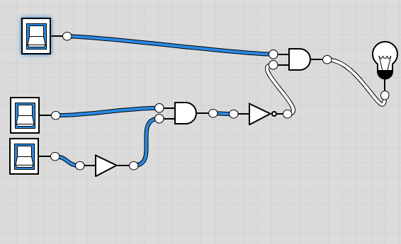
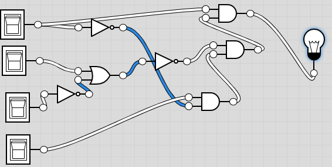

COMP110 Worksheet 4
===================

Please edit this README.md file with your answers to the worksheet questions.

Question 1 and Question 2
-------------------------

### A

| A | B | C | Output |
|---|---|---|--------|
| 0 | 0 | 0 | 0      |
| 1 | 0 | 0 | 0      |
| 0 | 1 | 0 | 0      |
| 1 | 1 | 0 | 1      |
| 0 | 0 | 1 | 0      |
| 1 | 0 | 1 | 0      |
| 0 | 1 | 1 | 0      |
| 1 | 1 | 1 | 0      |

A picture containing wall, indoor Description automatically generated

A picture containing wall, indoor Description automatically generated

A picture containing wall, indoor Description automatically generated

### B

| A | B | C | Output |
|---|---|---|--------|
| 0 | 0 | 0 | 0      |
| 1 | 0 | 0 | 1      |
| 0 | 1 | 0 | 0      |
| 1 | 1 | 0 | 1      |
| 0 | 0 | 1 | 0      |
| 1 | 0 | 1 | 1      |
| 0 | 1 | 1 | 0      |
| 1 | 1 | 1 | 0      |

### C

| A | B | C | Output |
|---|---|---|--------|
| 0 | 0 | 0 | 0      |
| 1 | 0 | 0 | 1      |
| 0 | 1 | 0 | 0      |
| 1 | 1 | 0 | 1      |
| 0 | 0 | 1 | 1      |
| 1 | 0 | 1 | 1      |
| 0 | 1 | 1 | 0      |
| 1 | 1 | 1 | 1      |

A close up of a device Description automatically generated

A close up of a device Description automatically generated

\~ A close up of a device Description automatically generated

### D

| A | B | C | D | Output |
|---|---|---|---|--------|
| 0 | 0 | 0 | 0 | 0      |
| 1 | 0 | 0 | 0 | 0      |
| 0 | 1 | 0 | 0 | 0      |
| 1 | 1 | 0 | 0 | 0      |
| 0 | 0 | 1 | 0 | 0      |
| 1 | 0 | 1 | 0 | 0      |
| 0 | 1 | 1 | 0 | 0      |
| 1 | 1 | 1 | 0 | 0      |
| 0 | 0 | 0 | 1 | 0      |
| 1 | 0 | 0 | 1 | 0      |
| 0 | 1 | 0 | 1 | 0      |
| 1 | 1 | 0 | 1 | 0      |
| 0 | 0 | 1 | 1 | 0      |
| 1 | 0 | 1 | 1 | 0      |
| 0 | 1 | 1 | 1 | 0      |
| 1 | 1 | 1 | 1 | 0      |

Question 3
----------

### A

| A  | B  | Output   |
|----|----|----------|
| 0  | 0  | 0        |
| 1  | 0  | 1        |
| 0  | 1  | 1        |
| 1  | 1  | 1        |
| A2 | B2 | Output 2 |
| 0  | 0  | 1        |
| 1  | 0  | 0        |
| 0  | 1  | 0        |
| 1  | 1  | 0        |

### B

| A  | B  | Output   |
|----|----|----------|
| 0  | 0  | 1        |
| 1  | 0  | 1        |
| 0  | 1  | 1        |
| 1  | 1  | 0        |
| A2 | B2 | Output 2 |
| 0  | 0  | 1        |
| 1  | 0  | 1        |
| 0  | 1  | 1        |
| 1  | 1  | 0        |

### C

| A  | B  | C  | Output   |
|----|----|----|----------|
| 0  | 0  | 0  | 0        |
| 1  | 0  | 0  | 0        |
| 0  | 1  | 0  | 0        |
| 0  | 0  | 1  | 0        |
| 1  | 1  | 0  | 1        |
| 1  | 0  | 1  | 1        |
| 0  | 1  | 1  | 0        |
| A2 | B2 | C2 | Output 2 |
| 0  | 0  | 0  | 0        |
| 1  | 0  | 0  | 0        |
| 0  | 1  | 0  | 0        |
| 0  | 0  | 1  | 0        |
| 1  | 1  | 0  | 1        |
| 0  | 1  | 1  | 0        |
| 1  | 0  | 1  | 1        |

### D

| A  | B  | C  | Output   |
|----|----|----|----------|
| 0  | 0  | 0  | 0        |
| 1  | 0  | 0  | 1        |
| 0  | 1  | 0  | 0        |
| 0  | 0  | 1  | 0        |
| 1  | 1  | 0  | 1        |
| 1  | 0  | 1  | 1        |
| 0  | 1  | 1  | 1        |
| A2 | B2 | C2 | Output 2 |
| 0  | 0  | 0  | 0        |
| 1  | 0  | 0  | 1        |
| 0  | 1  | 0  | 0        |
| 0  | 0  | 1  | 0        |
| 1  | 1  | 0  | 1        |
| 0  | 1  | 1  | 1        |
| 1  | 0  | 1  | 1        |

Question 4
----------

### A) not A or b = not a and not b

| A  | B  | Output   |
|----|----|----------|
| 0  | 0  | 1        |
| 1  | 0  | 0        |
| 0  | 1  | 1        |
| 1  | 1  | 1        |
| A2 | B2 | Output 2 |
| 0  | 0  | 1        |
| 1  | 0  | 0        |
| 0  | 1  | 0        |
| 1  | 1  | 0        |

### These are the same as question 3A because in the code it writes if not which refers to a not gate and in the code, there is an and gate as well and print command is counted as the output the only difference is the brackets are missing on these ones

### B) NOT A AND B = NOT A OR NOT B

| A  | B  | Output   |
|----|----|----------|
| 0  | 0  | 0        |
| 1  | 0  | 0        |
| 0  | 1  | 1        |
| 1  | 1  | 0        |
| A2 | B2 | Output 2 |
| 0  | 0  | 0        |
| 1  | 0  | 1        |
| 0  | 1  | 1        |
| 1  | 1  | 0        |

### C) A AND B OR A AND C = A AND B OR C

| A  | B  | C  | Output  |
|----|----|----|---------|
| 0  | 0  | 0  | 0       |
| 1  | 0  | 0  | 0       |
| 0  | 1  | 0  | 0       |
| 0  | 0  | 1  | 0       |
| 1  | 1  | 0  | 1       |
| 1  | 0  | 1  | 1       |
| 0  | 1  | 1  | 0       |
| 1  | 1  | 1  | 1       |
| A2 | B2 | C2 | Output2 |
| 0  | 0  | 0  | 0       |
| 1  | 0  | 0  | 0       |
| 0  | 1  | 0  | 0       |
| 0  | 0  | 1  | 1       |
| 1  | 1  | 0  | 1       |
| 1  | 0  | 1  | 1       |
| 0  | 1  | 1  | 1       |
| 1  | 1  | 1  | 1       |

### D) A OR B AND A OR C = A OR B AND C

| A  | B  | C  | Output  |
|----|----|----|---------|
| 0  | 0  | 0  | 0       |
| 1  | 0  | 0  | 1       |
| 0  | 1  | 0  | 0       |
| 0  | 0  | 1  | 0       |
| 1  | 1  | 0  | 1       |
| 1  | 0  | 1  | 1       |
| 0  | 1  | 1  | 1       |
| 1  | 1  | 1  | 1       |
| A2 | B2 | C2 | Output2 |
| 0  | 0  | 0  | 0       |
| 1  | 0  | 0  | 0       |
| 0  | 1  | 0  | 0       |
| 0  | 0  | 1  | 0       |
| 1  | 1  | 0  | 0       |
| 1  | 0  | 1  | 1       |
| 0  | 1  | 1  | 1       |
| 1  | 1  | 1  | 1       |
