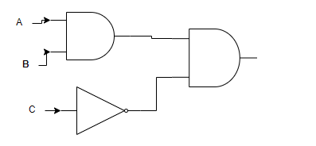
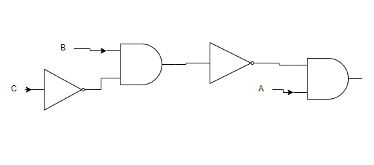
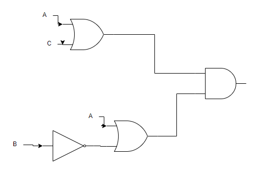
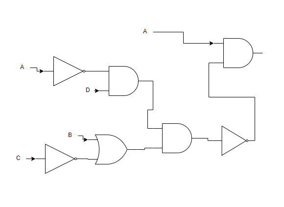

# COMP110 Worksheet 4

Please edit this README.md file with your answers to the worksheet questions.

## Question 1

### a 
A and B and not C
	
| A | B | C | A and B and not c|
|---|---|---|---|
| T	| T	| T	|False|
| T	| T	| F	|True|
| T	| F	| T	|False|
| T	| F	| F	|False|
| F	| F	| F	|False|
| F	| T	| F	|False|
| F	| T	| T	|False|
| F	| F	| T	|False|

### b
A AND NOT (B AND NOT C)

| A | B | C | not C |  (B and not c)| A and not (B and not C)|
|---|---|---|---|---|---|
| T	| T	| T	| False	|False |True |
| T	| T	| F	| True	|True  |False|
| T	| F	| T	| False	|False |True |
| T	| F	| F	| True	|True  |False|
| F	| F	| F	| True	|True  |False|
| F	| T	| F	| True	|True  |False|
| F	| T	| T	| False	|False |True |
| F	| F	| T	| False	|False |True |

### c
(A or not B) and (A or C)

|A |B |C |(A or not B)| (A or C)| (A or not B) and (A or C)|
|---|---|---|---|---|---|
|T |T |T | 	True	  |	True	| True |
|T |T |F | 	True 	  | True	| True |
|T |F |F | 	True 	  |	True	| True |
|T |F |T | 	True 	  | True	| True |
|F |T |T | 	False	  |	True	| False|
|F |T |F | 	False	  | False	| False|
|F |F |T | 	True 	  | True	| True |
|F |F |F | 	True 	  |	False	| False|

### d
A AND NOT (B OR NOT C) AND (NOT A AND D)

|A |B |C |D | (B or not C) | (not A and D) | A and not (B or not C) and (not A and D) |
|---|---|---|---|---|---|---|
|T |T |T |T | True | False | False |
|T |T |T |F | True | False | False |
|T |T |F |F | True | False | False |
|T |F |F |F | True | False | False | 
|T |F |F |T | True | False | False |
|T |F |T |T | True | False | False |
|T |T |F |T | True | False | False |
|T |T |F |F | True | False | False |
|F |F |F |F | True | False | False |
|F |T |T |T | True | True  | False |
|F |T |T |F | True | False | False |
|F |T |F |F | True | False | False |
|F |F |F |T | True | True  | False |
|F |F |T |T | False| True  | False |
|F |F |T |F | False| False | False |
|F |T |F |T | True | True  | False |

## Question 2

### a

### b

### c

### d

## Question 3

### a
A AND B AND NOT C

|A |B | not (A or B)| not A and not B |
|---|---|---|---|
|T |F |False|False |
|T |T |False|False |
|F |F |True |True  |
|F |T |False|False |

They are equal

### b
A AND NOT (B AND NOT C)

|A |B | not (A and B) | not A or not B |
|---|---|---|---|
|T |F |True |True |
|T |T |False|False|
|F |F |True |True |
|F |T |True |True |

They are equal

### c
(A OR NOT B) AND (A OR C)

|A |B |C | (A and B) | (A and C) | (A and B) or (A and C)| (B or C) |A and (B or C)
|---|---|---|---|---|---|---|---|
|T |T |T |True |True |True |True |True |
|T |T |F |True |False|True |True |True |
|T |F |F |False|False|False|False|False|
|T |F |T |False|True |True |True |False|
|F |F |F |False|False|False|False|False|
|F |F |T |False|False|False|True |False|
|F |T |T |False|False|False|True |False|
|F |T |F |False|False|False|True |False|

They are not the same

### d
(A OR B) AND (A OR C) = A OR (B AND C)

|A |B |C | (A or B) | (A or C) |(A or B) and (A or C) | (B and C)| A or (B and C)|
|---|---|---|---|---|---|---|
|T |T |T | True | True |True |True |True |
|T |T |F | True | True |True |False|True |
|T |F |F | True | False|False|False|True |
|T |F |T | True | True |True |False|True |
|F |F |F | False| False|False|False|False|
|F |T |F | True | False|False|False|False|
|F |F |T | False| True |False|False|False|
|F |T |T | True | True |True |True |False|

## Question 4

### a

### b

### c

### d

