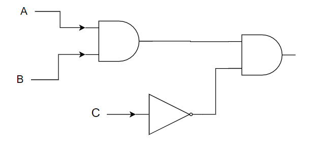
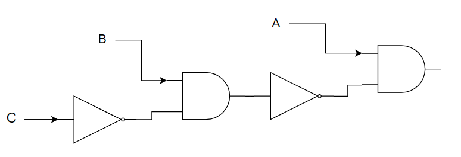
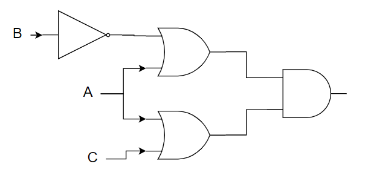
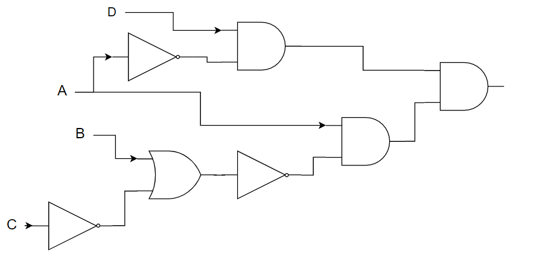

# COMP110 Worksheet 4

Please edit this README.md file with your answers to the worksheet questions.

## Question 1

### a

|ABC|A&B|¬C|output|
|---|---|---|---|
|000| 0 | 1 | 0 |
|001| 0 | 0 | 0 |
|010| 0 | 1 | 0 |
|100| 0 | 1 | 0 |
|011| 0 | 0 | 0 |
|101| 0 | 0 | 0 |
|110| 1 | 1 | 1 |
|111| 1 | 0 | 0 |

### b
|ABC|¬C|B&¬C|¬(B&¬C|output|
|---|---|---|---|---| 
|000| 1 | 0 | 1 | 0 |
|001| 0 | 0 | 1 | 0 |
|010| 1 | 1 | 0 | 0 |
|100| 1 | 0 | 1 | 1 |
|011| 0 | 0 | 1 | 0 |
|101| 0 | 0 | 1 | 1 |
|110| 1 | 1 | 0 | 0 |
|111| 0 | 0 | 1 | 1 |

### c

|ABC|¬b|A+¬B|A+C|output|
|---|---|---|---|---|
|000| 1 | 1 | 0 | 0 |
|001| 1 | 1 | 1 | 1 |
|010| 0 | 0 | 0 | 0 |
|100| 1 | 1 | 1 | 1 |
|011| 0 | 0 | 1 | 0 |
|101| 1 | 1 | 1 | 1 |
|110| 1 | 1 | 1 | 1 |
|111| 1 | 1 | 1 | 1 |

### d

|ABCD|¬(B+¬C)|A&¬(B+¬C)|(¬A&B)|output|
|---|---|---|---|---|
|0000|0 | 0 | 0 | 0 |
|0001|0 | 0 | 1 | 0 |
|0010|1 | 0 | 0 | 0 |
|0011|1 | 0 | 1 | 0 |
|0100|0 | 0 | 0 | 0 |
|0101|0 | 0 | 1 | 0 |
|0110|0 | 0 | 0 | 0 |
|0111|0 | 0 | 1 | 0 |
|1000|0 | 0 | 0 | 0 |
|1001|0 | 0 | 0 | 0 |
|1010|1 | 1 | 0 | 0 |
|1011|1 | 1 | 0 | 0 |
|1100|0 | 0 | 0 | 0 |
|1101|0 | 0 | 0 | 0 |
|1110|0 | 0 | 0 | 0 |
|1111|0 | 0 | 0 | 0 |

## Question 2

### a

### b

### c

### d

## Question 3

### a

|AB |A+B|¬(a+B)|
|---|---|---|
|00 | 0 | 1 |
|01 | 1 | 0 |
|10 | 1 | 0 |
|11 | 1 | 0 |

|AB |¬A|¬B|¬A&¬B|
|---|---|---|---|
|00 | 1 | 1 | 1 |
|01 | 1 | 0 | 0 |
|10 | 0 | 1 | 0 |
|11 | 0 | 0 | 0 |

Same output therefore equal.

### b

|AB |A&B|¬(a&B)|
|---|---|---|
|00 | 0 | 1 |
|01 | 0 | 1 |
|10 | 0 | 1 |
|11 | 1 | 0 |

|AB |¬A|¬B|¬A+¬B|
|---|---|---|---|
|00 | 1 | 1 | 1 |
|01 | 1 | 0 | 1 |
|10 | 0 | 1 | 1 |
|11 | 0 | 0 | 0 |

Same output therefore equal.

### c

|ABC|A&B|A&C|(A&B)+(A&C)|
|---|---|---|---|
|000| 0 | 0 | 0 |
|001| 0 | 0 | 0 |
|010| 0 | 0 | 0 |
|100| 0 | 0 | 0 |
|011| 0 | 0 | 0 |
|101| 0 | 1 | 1 |
|110| 1 | 0 | 1 |
|111| 1 | 1 | 1 |

|ABC|B+C|A&(B+C)|
|---|---|---|
|000| 0 | 0 |
|001| 1 | 0 |
|010| 1 | 0 |
|100| 0 | 0 |
|011| 1 | 0 |
|101| 1 | 1 |
|110| 1 | 1 |
|111| 1 | 1 |

Same output therefore equal.

### d

|ABC|A+B|A+C|(A+B)&(A+C)|
|---|---|---|---|
|000| 0 | 0 | 0 |
|001| 0 | 1 | 0 |
|010| 1 | 0 | 0 |
|100| 1 | 1 | 1 |
|011| 1 | 1 | 1 |
|101| 1 | 1 | 1 |
|110| 1 | 1 | 1 |
|111| 1 | 1 | 1 |

|ABC|B&C|A+(B&C)|
|---|---|---|
|000| 0 | 0 |
|001| 0 | 0 |
|010| 0 | 0 |
|100| 0 | 1 |
|011| 1 | 1 |
|101| 0 | 1 |
|110| 0 | 1 |
|111| 1 | 1 |

Same output therefore equal.

## Question 4

### a

file_exists("a.txt") maps to A, file_exists("b.txt") maps to B  
4a)1. maps to NOT(A AND B)  
   2. maps to NOT A OR NOT B  
  NOT(A AND B) = NOT A OR NOT B as shown in question 3b therefore the identity holds.
  
### b

x > 7 maps to A, type(x) == int maps to B, type(x) == float maps to C  
4a)1. maps to NOT(A AND B) OR (A AND C)  
   2. maps to NOT A AND (B or C)  
  NOT(A AND B) OR (A AND C) = NOT A AND (B or C) as shown in question 3c therefore the identity holds.

### c

(if x == 0 and y == 0) maps to A AND B  
(if x != 0 or y != 0) maps to NOT A OR NOT B  
They are equal because the result of the if statement is inverted so  
A AND B can be written as NOT(A AND B) and then the result of the statement can be flipped  
so NOT(A AND B) = NOT A OR NOT B as seen in question 3b

### d

This pair of programs is not equivalent  

1.
|ABC|B&C|A+(B&C)|
|---|---|---|
|000| 0 | 0 |
|001| 0 | 0 |
|010| 0 | 0 |
|100| 0 | 1 |
|011| 1 | 1 |
|101| 0 | 1 |
|110| 0 | 1 |
|111| 1 | 1 |

2.
|ABC|A+C|B&(A+C)|
|---|---|---|
|000| 0 | 0 |
|001| 1 | 0 |
|010| 0 | 0 |
|100| 1 | 1 |
|011| 1 | 0 |
|101| 1 | 0 |
|110| 1 | 1 |
|111| 1 | 1 |
