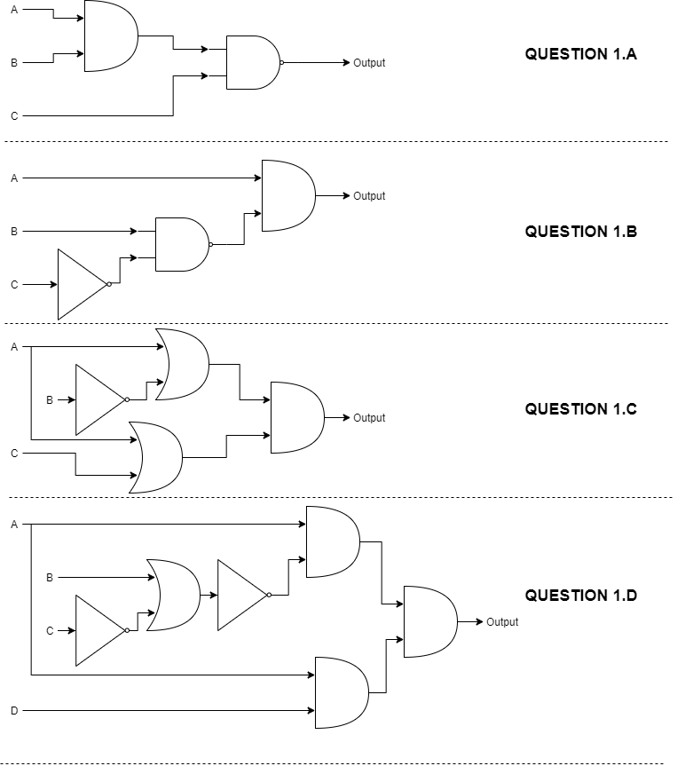

# COMP110 Worksheet 4

Please edit this README.md file with your answers to the worksheet questions.

## Question 1

### a

A  |  B  |  C  |  A AND B  |  NOT C  |  A AND B AND NOT C
---|-----|-----|-----|-----|---
false|false|false|false|true|false
false|false|true|false|false|false
false|true|false|false|true|false
false|true|true|false|false|false
true|false|false|false|true|false
true|false|true|false|false|false
true|true|false|true|true|true
true|true|true|true|false|false

### b

A  |  B  |  C  |  NOT C  |  B AND NOT C  |  A AND NOT(B AND NOT C)
---|-----|-----|-----|-----|---
false|false|false|true|false|false
false|false|true|false|false|false
false|true|false|true|true|false
false|true|true|false|false|false
true|false|false|true|false|true
true|false|true|false|false|true
true|true|false|true|true|false
true|true|true|false|false|true

### c

A  |  B  |  C  |  NOT B  |  A OR NOT B |  A OR C  | (A OR NOT B) AND (A OR C)
---|-----|-----|-----|-----|-----|---
false|false|false|true|true|false|false
false|false|true|true|true|true|true
false|true|false|false|false|false|false
false|true|true|false|false|true|false
true|false|false|true|true|true|true
true|false|true|true|true|true|true
true|true|false|false|true|true|true
true|true|true|false|true|true|true

### d

A  |  B  |  C  |  D  |  NOT A  |  NOT C  |  B OR NOT C  |  NOT (B OR NOT C)  |  NOT A AND D  |  NOT (B OR NOT C) AND (NOT A AND D) |  A AND NOT (B OR NOT C) AND (NOT A AND D)
---|-----|-----|-----|-----|-----|-----|-----|-----|-----|---
false|false|false|false|true|true|true|false|false|false|false
false|false|false|true|true|true|true|false|true|false|false
false|false|true|false|true|false|false|true|false|false|false
false|false|true|true|true|false|false|true|true|true|false
false|true|false|false|true|true|true|false|false|false|false
false|true|false|true|true|true|true|false|true|false|false
false|true|true|false|true|false|true|false|false|false|false
false|true|true|true|true|false|true|false|true|false|false
true|false|false|false|false|true|true|false|false|false|false
true|false|false|true|false|true|true|false|false|false|false
true|false|true|false|false|false|false|true|false|false|false
true|false|true|true|false|false|false|true|false|false|false
true|true|false|false|false|true|true|false|false|false|false
true|true|false|true|false|true|true|false|false|false|false
true|true|true|false|false|false|true|false|false|false|false
true|true|true|true|false|false|true|false|false|false|false

## Question 2

## Question 3

### a

A  |  B  |  A OR B |  NOT (A OR B)  | NOT A | NOT B |  NOT A AND NOT B
---|-----|-----|-----|-----|-----|---
false|false|false|true|true|true|true
false|true|true|false|true|false|false
true|false|true|false|false|true|false
true|true|true|false|false|false|false

### b

A  |  B  |  A AND B  | NOT (A AND B)  | NOT A | NOT B |  NOT A OR NOT B
---|-----|-----|-----|-----|-----|---
false|false|false|true|true|true|true
false|true|false|true|true|false|true
true|false|false|true|false|true|true
true|true|true|false|false|false|false

### c

A  |  B  |  C  |  A AND B  |  A AND C  |  (A AND B) OR (A AND C) |  B OR C  | A AND (B OR C)
---|-----|-----|-----|-----|-----|-----|---
false|false|false|false|false|false|false|false
false|false|true|false|false|false|true|false
false|true|false|false|false|false|true|false
false|true|true|false|false|false|true|false
true|false|false|false|false|false|false|false
true|false|true|false|true|true|true|true
true|true|false|true|false|true|true|true
true|true|true|true|true|true|true|true

### d

A  |  B  |  C  |  A OR B  |  A OR C  |  (A OR B) AND (A OR C)  |  B AND C  | A OR (B AND C)
---|-----|-----|-----|-----|-----|-----|---
false|false|false|false|false|false|false|false
false|false|true|false|true|false|false|false
false|true|false|true|false|false|false|false
false|true|true|true|true|true|true|true
true|false|false|true|true|true|false|true
true|false|true|true|true|true|false|true
true|true|false|true|true|true|false|true
true|true|true|true|true|true|true|true

## Question 4

### a

"a.txt" exists  |  "b.txt" exists |  not("a.txt" and "b.txt")  |  not("a.txt") or not("b.txt")
---|-----|-----|---
false|false|true|true
false|true|true|true
true|false|true|true
true|true|false|false

### b

type(x) == int  |  x > 7  |  type(x) == float  |  type(x) == int and x > 7  |  type(x) == float and x > 7  | (type(x) == int and x > 7) or (type(x) == float and x > 7)  |  type(x) == int or type(x) == float  |  (type(x) == int or type(x) == float) and x > 7
---|-----|-----|-----|-----|-----|-----|---
false|false|false|false|false|false|false|false|
false|false|true|false|false|false|true|false|
false|true|false|false|false|false|false|false|
false|true|true|false|true|true|true|true|true|
true|false|false|false|false|false|true|false|
true|false|true|false|false|false|true|false|
true|true|false|true|false|true|true|true|
true|true|true|true|true|true|true|true|

### c

### d

