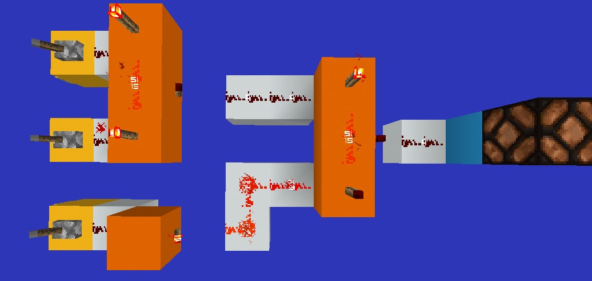
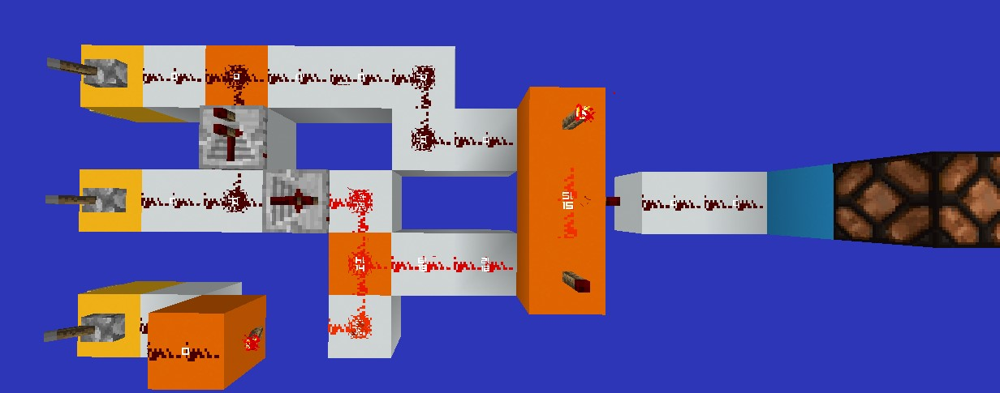
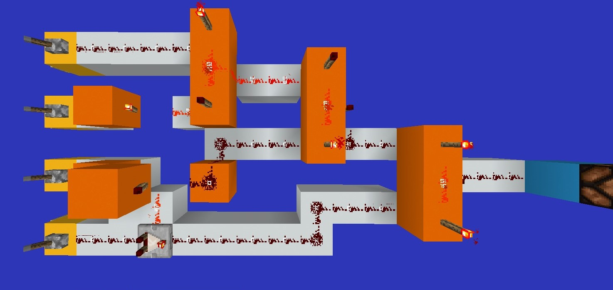
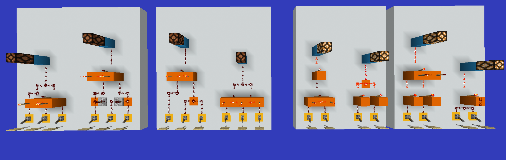
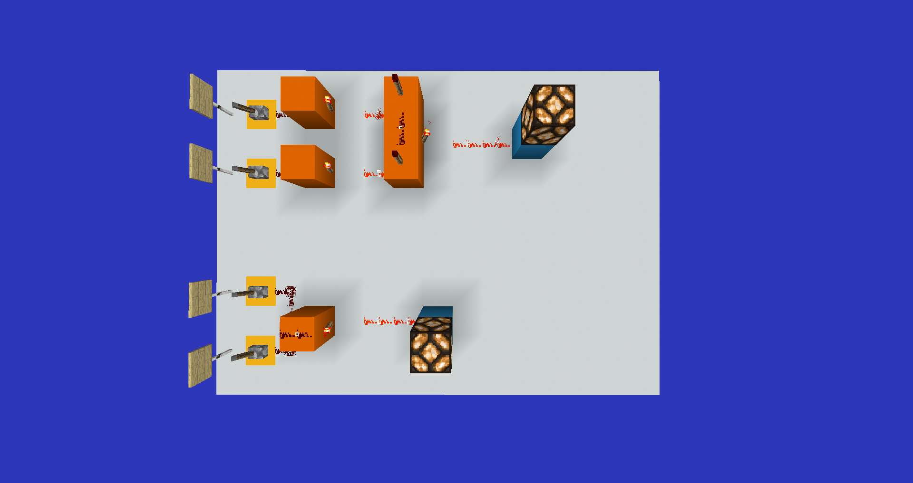
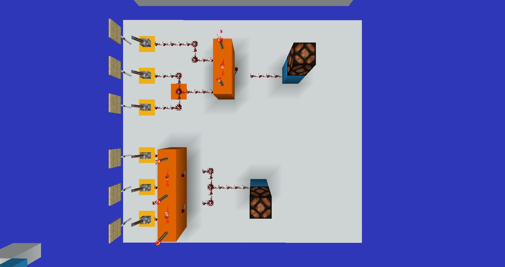
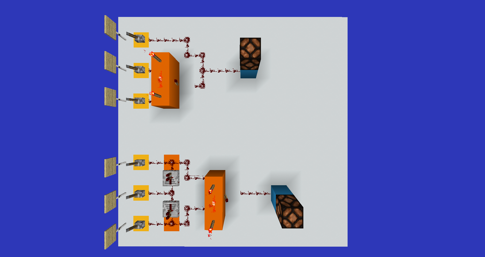

# COMP110 Worksheet 4

<!--

## Truth Table Template (1 node)

**A**

| A   | Output |
| --- | ------ |
| 0   | 0      |
| 1   | 1      |

## Truth Table Template (2 nodes)

**A xor B**

| A   | B   | Output |
| --- | --- | ------ |
| 0   | 0   | 0      |
| 1   | 0   | 1      |
| 0   | 1   | 1      |
| 1   | 1   | 0      |

## Truth Table Template (3 nodes)

**??**

| A   | B   | C   | Output |
| --- | --- | --- | ------ |
| 0   | 0   | 0   | 0      |
| 1   | 0   | 0   | 0      |
| 0   | 1   | 0   | 0      |
| 0   | 0   | 1   | 0      |
| 1   | 1   | 0   | 0      |
| 1   | 0   | 1   | 0      |
| 0   | 1   | 1   | 0      |
| 1   | 1   | 1   | 1      |

## Truth Table Template (4 nodes)

**??**

| A   | B   | C   | D   | Output |
| --- | --- | --- | --- | ------ |
| 0   | 0   | 0   | 0   |        |
| 1   | 0   | 0   | 0   |        |
| 0   | 1   | 0   | 0   |        |
| 0   | 0   | 1   | 0   |        |
| 1   | 1   | 0   | 0   |        |
| 1   | 0   | 1   | 0   |        |
| 1   | 0   | 0   | 1   |        |
| 0   | 1   | 1   | 0   |        |
| 0   | 1   | 0   | 1   |        |
| 0   | 0   | 1   | 1   |        |
| 1   | 1   | 1   | 0   |        |
| 1   | 1   | 0   | 1   |        |
| 1   | 0   | 1   | 1   |        |
| 0   | 1   | 1   | 1   |        |
| 1   | 1   | 1   | 1   |        |

-->

## Question 1

> Write out the truth tables for the following boolean expressions, for all possible values of boolean variables A, B, C, . . .

### 1A

**A and B and not C**

| A   | B   | C   | Output |
| --- | --- | --- | ------ |
| 0   | 0   | 0   | 0      |
| 1   | 0   | 0   | 0      |
| 0   | 1   | 0   | 0      |
| 0   | 0   | 1   | 0      |
| 1   | 1   | 0   | 1      |
| 1   | 0   | 1   | 0      |
| 0   | 1   | 1   | 0      |
| 1   | 1   | 1   | 0      |

### 1B

**A and not (B and not C)**

| A   | B   | C   | Output |
| --- | --- | --- | ------ |
| 0   | 0   | 0   | 0      |
| 1   | 0   | 0   | 1      |
| 0   | 1   | 0   | 0      |
| 0   | 0   | 1   | 0      |
| 1   | 1   | 0   | 1      |
| 1   | 0   | 1   | 1      |
| 0   | 1   | 1   | 0      |
| 1   | 1   | 1   | 1      |

### 1C

**(A or not B) and (A or C)**

| A   | B   | C   | Output |
| --- | --- | --- | ------ |
| 0   | 0   | 0   | 0      |
| 1   | 0   | 0   | 1      |
| 0   | 1   | 0   | 1      |
| 0   | 0   | 1   | 0      |
| 1   | 1   | 0   | 1      |
| 1   | 0   | 1   | 0      |
| 0   | 1   | 1   | 1      |
| 1   | 1   | 1   | 1      |

### 1D

**A and not (B or not C) and (not A and D)**

| A   | B   | C   | D   | Output |
| --- | --- | --- | --- | ------ |
| 0   | 0   | 0   | 0   | 0      |
| 1   | 0   | 0   | 0   | 0      |
| 0   | 1   | 0   | 0   | 0      |
| 0   | 0   | 1   | 0   | 0      |
| 1   | 1   | 0   | 0   | 0      |
| 1   | 0   | 1   | 0   | 0      |
| 1   | 0   | 0   | 1   | 1      |
| 0   | 1   | 1   | 0   | 0      |
| 0   | 1   | 0   | 1   | 0      |
| 0   | 0   | 1   | 1   | 0      |
| 1   | 1   | 1   | 0   | 0      |
| 1   | 1   | 0   | 1   | 0      |
| 1   | 0   | 1   | 1   | 0      |
| 0   | 1   | 1   | 1   | 0      |
| 1   | 1   | 1   | 1   | 1      |

## Question 2

> Draw logic circuits for each of the expressions in Question 1.

### 2A



- [SVG (2A)](./circuits/2A.svg)
- [Redstone (2A)](./redstone/Diagram2A.png)

### 2B


- [SVG (2B)](./circuits/2B.svg)
- [Redstone (2B)](./redstone/Diagram2B.png)

### 2C



- [SVG (2C)](./circuits/2C.svg)
- [Redstone (2C)](./redstone/Diagram2C.png)

### 2D



- [SVG (2D)](./circuits/2D.svg)
- [Redstone (2D)](./redstone/Diagram2D.png)

## Question 3

> Use truth tables to show that the following identities hold:



### 3A

**NOT (A OR B) = NOT A AND NOT B**



- [Redstone (3A)](redstone/Diagram3A.png)

| A   | B   | Output |
| --- | --- | ------ |
| 0   | 0   | 1      |
| 1   | 0   | 0      |
| 0   | 1   | 0      |
| 1   | 1   | 0      |

### 3B

**NOT (A AND B) = NOT A OR NOT B**

)

- [Redstone (3B)](redstone/DChild outcome isB.png)`type(x) == int` is assigned to A.`type(x) == float` is assigned to B.


| A   | B   | Output |
| --- | --- | ------ |
| 0   | 0   | 1      |
| 1   | 0   | 1      |
| 0   | 1   | 1      |
| 1   | 1   | 0      |

### 3C

**(A AND B) OR (A AND C) = A AND (B OR C)**



- [Redstone (3C)](redstone/Diagram3C.png)

| A   | B   | C   | Output |
| --- | --- | --- | ------ |
| 0   | 0   | 0   | 0      |
| 1   | 0   | 0   | 0      |
| 0   | 1   | 0   | 0      |
| 0   | 0   | 1   | 0      |
| 1   | 1   | 0   | 1      |
| 1   | 0   | 1   | 1      |
| 0   | 1   | 1   | 0      |
| 1   | 1   | 1   | 1      |

### 3D

**(A OR B) AND (A OR C) = A OR (B AND C)**



- [Redstone (3D)](redstone/Diagram3D.png)

| A   | B   | C   | Output |
| --- | --- | --- | ------ |
| 0   | 0   | 0   | 0      |
| 1   | 0   | 0   | 1      |
| 0   | 1   | 0   | 0      |
| 0   | 0   | 1   | 0      |
| 1   | 1   | 0   | 1      |
| 1   | 0   | 1   | 1      |
| 0   | 1   | 1   | 1      |
| 1   | 1   | 1   | 1      |

## Question 4

> Explain, using the identities in Question 3 and/or truth tables, why each of the following pairs of programs is equivalent

### 4A

```py
# [A]
if not ( file_exists ("a . txt ") and file_exists ( "b. txt " )):
	print ("A required file is missing ")
	
# [B]
if not file_exists ("a . txt ") or not file_exists (" b. txt " ):
	print ("A required file is missing ")
```

If either `./a.txt` **OR** `./b.txt` does not exist THEN, print the message `"A required file is missing"`.

Where referencing to 3A:
- `file_exists("a.txt")` is assigned to A.
- `file_exists("b.txt")` is assigned to B.
- Condition output is assigned to Output.

### 4B

```py
# [A]
if ( type ( x) == int and x > 7) or ( type (x) == float and x > 7):
	print (" Hello ")

# [B]
if ( type ( x) == int or type (x ) == float ) and x > 7:
	print (" Hello ")
```

If `x` is of type `int` (Integer) or `float` (Real) **AND** `x` is greater than `7` THEN, print `"Hello"`.

Where referencing to 3C:
- `x > 7` is assigned to A.
- `type(x) == int` is assigned to B.
- `type(x) == float` is assigned to C.
- Condition output is assigned to Output.

### 4C

```py
# [A]
if x == 0 and y == 0:
	do_something ()
else :
	print (" Do nothing ")

# [B]
if x != 0 or y != 0:
	print (" Do nothing ")
else :
	do_something ()
```

If `x` **AND** `y` are equal to `0` THEN, run method `do_something` with no arguments.

Where referencing to 3B:
- `x == 0` is assigned to A.
- `y == 0` is assigned to B.
- Condition output is assigned to Output.

### 4D

```py
# [A]
if x > 10 or (x > 0 and y > 0):
	do_something ()

# [B]
if x > 0 and (x > 10 or y > 0):
	do_something ()
```

If `x` is less than `10` **OR** (`x` **AND** `y` are greater than `0`) THEN, run method `do_something` with no arguments.

Where referencing to 3D:
- `x > 10` is assigned to A.
- `x > 0` is assigned to B.
- `y > 0` is assigned to C.